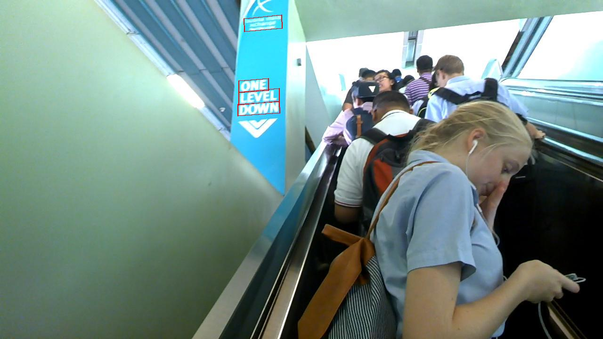
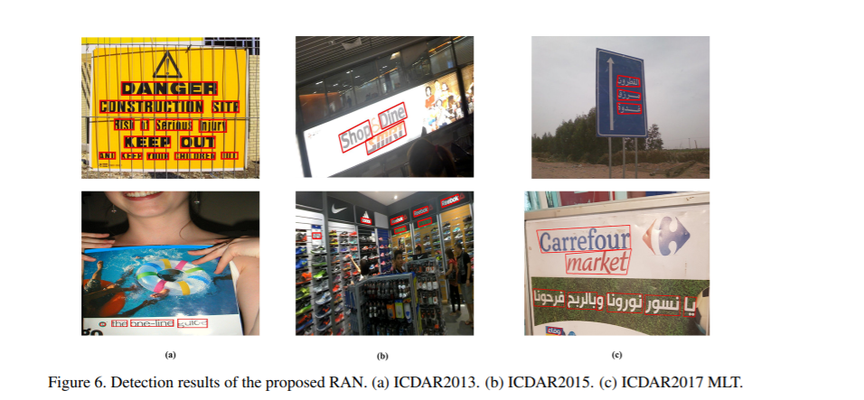
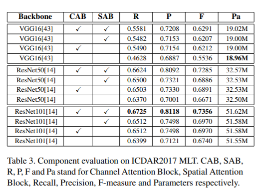
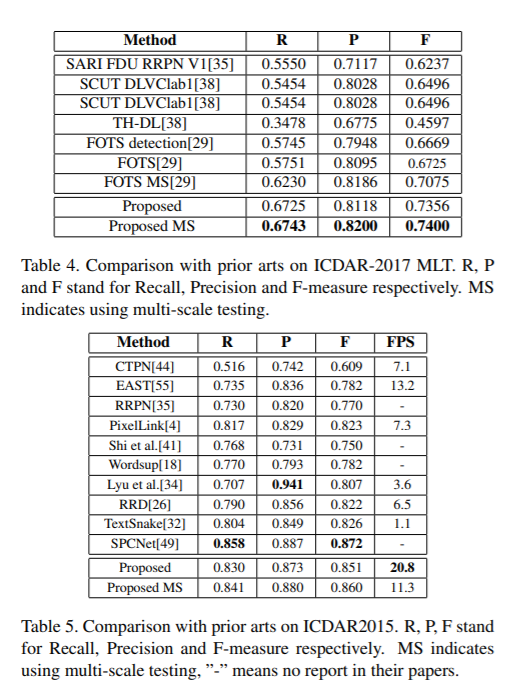
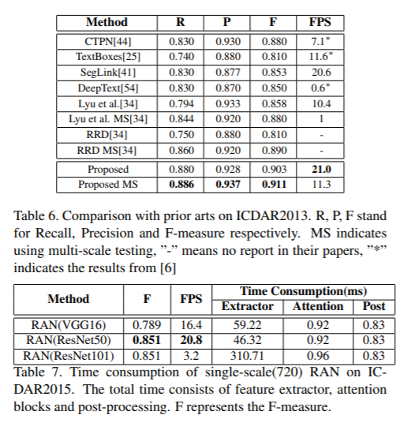

# Scene Text Detection and Recognition
         
The `VTD` project is on scene text detection and recognition, based on `EAST', 'CTPN' and 'CRNN'.  
## RoadMap
Scene Text Detection is a fast evolving field with new techniques and architectures being published frequently.  
The goal of this project is facilitating the development of such techniques and applications. While constantly improving the quality of code and readme.  
The main functions and models of VTD are as follows:
* Detection: EAST, CTPN and my designed network
* Recognition: CRNN
* GPU_Tracker: track your gpu usage
## Usage
First of all, the `data` package is a preprocess lib to resize or extract the text area.  
'Detection' includes these fancy models, how to use them? start with the `main.py` script of each model. And do not foget to change the data path for your own data.  
`Recognition` only includes the CRNN model, and start with `main.py` to train your network. For details, you can read the arguments of  `DataGenerator.py`.
## Demo

## Comparison
To verify the effectiveness of our proposed framework,
we did a series of comparative experiments on the ICDAR2013, ICDAR2015 and ICDAR2017 data sets. These
experiments mainly focus on evaluating two essential methods in our model: Channel Attention Block, and Spatial
Attention Block. All the experiments are based on single model and single-scale, the scales of testing images are set
as 720 for three benchmark datasets.

## Author
* **Shuai Li (李帅)** - *all work*

## License
This project is licensed under the Apache License 2.0 - see the [LICENSE](LICENSE) file for details
